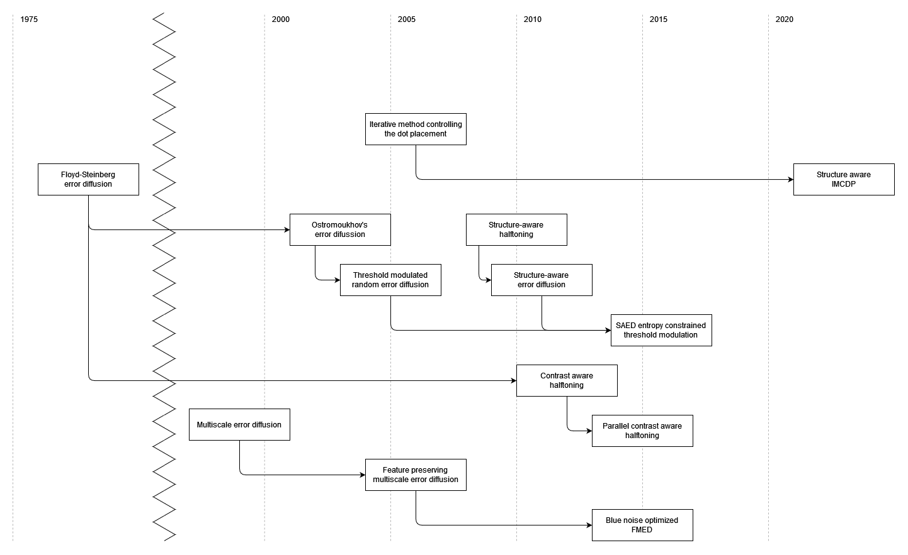

# 2. Related Work

- What is error-diffusion?
    - Error diffusion is a halftoning method where the quantization residual is distributed to nearby pixels.
- What are its pros and cons?
    - Error diffusion has a tendency to sharpen edges, which makes it more desirable than other half-toning algorithms such as ordered dithering. The main disadvantages it has are that it is hard to parallelize and that it produces undesirable artifacts in flatly shaded regions.
    - A number of strategies and improvements have been devised over the years to make of for the shortcomings and to improve the visual quality of the images produced.
- What is the current state of the art in the field?
    - There are two converging fronts of research that we are focusing on. The first attempts to improve image structure reproduction by enhancing edges, contrast, and high-frequency detail.
    - The second attempts to improve the quality of tone reproduction by reducing artifacts produced by error diffusion at certain tone values.
    - On the first front, we focus on the lineage of papers that is inspired by and builds up on Structure Aware Halftoning [@Pang2008]. This paper is independent from the underlying halftoning algorithm used but it is very expensive to implement as it uses a simulated annealing approach to finding an image that maximizes a value function (MSSIM).
    - The next improvement on this approach was @Chang2009 which proposes using error diffusion alongside a precalculated lookup table of diffusion coefficients and thresholds to produce a result of similar quality as @Pang2008.
    - Contrast aware halftoning [@Li2010], inspired by these earlier methods, attempts a similar feat by diffusing error conditionally to enhance edge contrast.
    - On the second front we have two papers.
    - @Ostromoukhov2001 uses a precomputed lookup table of diffusion coefficients that produces results with blue-noise properties, which is reported to be preferred by observers.
    - @Zhou2003 Build up on the idea by introducing modulated random noise to the threshold values to get rid of visual artifacts present in @Ostromoukhov2001 at certain tone values.
    - Finally @Liu2014 is where both fronts converge. It uses entropy-constrained threshold-modulation to maximize random noise in areas that don't contribute structural information to the image and maximize structure in areas where detail is important.
    - While this last paper focuses on merging entropy-constrained threshold-modulation (ECTM), it is agnostic to the error diffusion method of choice. Therefore it can employ other ED strategies as a baseline.
